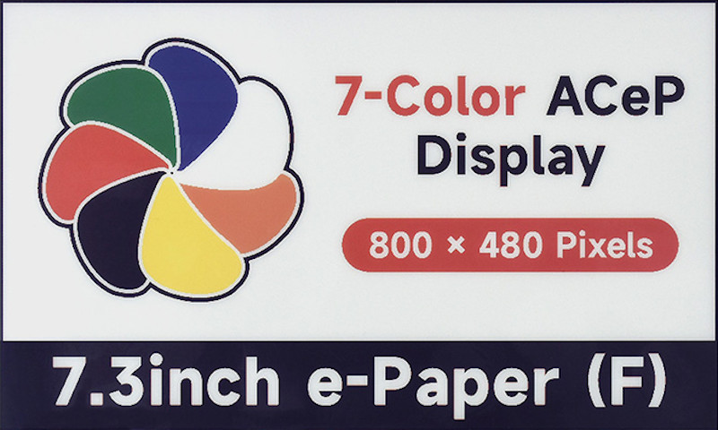

<!DOCTYPE html>
<html>
<body style="background-color: #ccccff;">
<!-- var -->

[English] <a href="#lang_ja">[日本語]</a>

<h1 align="center">Improved Photo Frame with a 7.3 inch 7 Color E-Paper</h1>
<h2>Introduction</h2>

After creating a <a href="https&#58;//github.com/middle-river/color_epd_photo">photo frame using a 5.65&quot; 7 color e-paper</a>, I recently got a 7.3&quot; 7 color e-paper and made an improved photo frame.

(Updated on January 2025) A <a href="https&#58;//github.com/middle-river/color_epd_photo3">photo frame</a> using a new type of color e-paper was made.

<h2>Conversion of Images</h2>

The e-paper can display only seven colors (black, white, green, blue, red, yellow, and orange), therefore the colors in images need to be reduced. The last time I made the photo frame, I used a color palette consisting of pure primary colors in the same way as the sample code from the vendor. However, the colors that can actually be displayed on the device are somewhat dull. The images below are the original image data with the pure primary colors, and a sample image from the manufacturer's product page.

<figure style="display: inline-table;"><a href="sample_original.png"><figcaption>Original image</figcaption></a></figure>
<figure style="display: inline-table;"><a href="sample_actual.jpg"><figcaption>Sample image of actual display</figcaption></a></figure>

The following RGB color palette was obtained from the sample image, and I will call it &quot;sample image palette&quot; hereafter&#58;

<table align="center" border="1">
<tr>
<td align="center"><strong>Color</strong></td>
<td align="center"><strong>Pure Color Palette</strong></td>
<td align="center"><strong>Sample Image Palette</strong></td>
</tr>
<tr>
<td align="center">Black</td>
<td align="center">(  0,   0,   0)</td>
<td align="center">( 35,  30,  53)</td>
</tr>
<tr>
<td align="center">White</td>
<td align="center">(255, 255, 255)</td>
<td align="center">(233, 235, 234)</td>
</tr>
<tr>
<td align="center">Green</td>
<td align="center">(  0, 255,   0)</td>
<td align="center">( 53, 102,  78)</td>
</tr>
<tr>
<td align="center">Blue</td>
<td align="center">(  0,   0, 255)</td>
<td align="center">( 51,  53, 118)</td>
</tr>
<tr>
<td align="center">Red</td>
<td align="center">(255,   0,   0)</td>
<td align="center">(203,  85,  82)</td>
</tr>
<tr>
<td align="center">Yellow</td>
<td align="center">(255, 255,   0)</td>
<td align="center">(235, 215, 100)</td>
</tr>
<tr>
<td align="center">Orange</td>
<td align="center">(255, 127,   0)</td>
<td align="center">(207, 120,  95)</td>
</tr>
</table>

Images displayed on the device are significantly improved by using this sample image palette instead of the pure color palette when reducing the number of colors in images. Below are examples of converted images. The left is the original image, the center is the image converted with the pure primary color palette and displayed on the device, and the right is the image converted with the sample image palette and displayed on the device.

<figure style="display: inline-table;"><a href="demo_comparison.jpg"><figcaption>Comparison of images converted with different palettes</figcaption></a></figure>

The colors are fairly dull when the pure color palette is used, whereas the colors reproduce better when the sample image palette was used. In addition to the better color saturation, the latter is less noisy. The images below show the results of color conversion using the pure color palette (left) and the sample image palette (right), both of which are displayed using the pure color palette.

<figure style="display: inline-table;"><a href="demo_display.png"><figcaption>Images displayed with the pure color palette</figcaption></a></figure>

The colors are very emphasized when the image is converted with the sample image palette and displayed with the pure color palette.

The following Python code can convert full-color images using the sample image palette and Floyd-Steinberg dithering.

<pre style="background-color: #ccffcc">
from PIL import Image
pal_ideal  = [ 0,  0,  0, 255, 255, 255,  0, 255,  0,  0,  0, 255, 255,  0,   0, 255, 255,   0, 255, 127,   0]
pal_actual = [35, 30, 53, 233, 235, 234, 53, 102, 78, 51, 53, 118, 203, 85,  82, 235, 215, 100, 207, 120,  95]
palimg = Image.new('P', (1, 1))
palimg.putpalette(pal_actual + pal_actual[-3:] * 249)
img = Image.open('INPUT.jpg').quantize(palette=palimg)
img.putpalette(pal_ideal + pal_ideal[-3:] * 249)
img.save('OUTPUT.png')
#img.save('OUTPUT.gif', interlace=False, palette=pal_ideal, comment='')  # for GIF with the fixed palette.
</pre>

This code outputs a PNG file. The photo frame made here supports only GIF files with a fixed palette, so the last line needs to be uncommented in that case.

<h3>Experiment of Optimizing Palettes</h3>

The &quot;sample image palette&quot; was obtained from the sample image on manufacturer's product page, but the actual device has further duller colors. I tried to use the palette which is more similar to the actual device, but the resulting images were worse than those obtained with the sample image palette. Specifically, the images were noisier. It seems using faithful color palettes does not necessarily give better image quality. I experimented to optimize color palettes. A simple approach was implemented to find the best palette among candidate color palettes made by changing saturation and brightness for the pure color palette, in terms of the mean error for the nearest palette color over all pixels in the image. <a href="https&#58;//github.com/middle-river/color_epd_photo2/tree/main/palette_optimizer">Here </a> is the Python script. I applied it to some images but the image quality became worse in several cases, and it may need more improvement for obtaining the optimal palette for any image. I mainly used the sample image palette when preparing image data for this photo frame.

<h2>Hardware</h2>

The 7 color e-paper used here is <a href="https&#58;//www.waveshare.com/7.3inch-e-paper-hat-f.htm">Waveshare 7.3inch e-Paper HAT (F)</a>, with the resolution of 800x480. It is controlled by SPI interface.

For controlling the e-paper, ESP32 was used because it has the flash memory large enough to store images. I used ESP32 with 16 MB flash memory last time, but used ESP32 with 4 MB this time.

A simple adapter board for ESP32 was used. This board has a pulled-up tactile switch connected to GPIO0, which is used for operating this photo frame.

The power source is two AA batteries, and the ESP32 and e-paper are put into deep sleep when not in use. The total current consumption is less than 10 μA in deep sleep, and about 160 mA when refreshing the screen. It takes 35 seconds to refresh the screen, so alkaline AA batteries will last about a year when the screen is refreshed several times a day. If the battery voltage falls below 2.3 V, it will go into the hibernation mode and will not resume from sleep.

The circuit is very simple, so I wrote the following table for wiring instead of drawing a schematic. ESP, EPD, BAT, and CON respectively represent ESP32, e-paper, battery, and the connector for programming the flash.

<table align="center" border="1">
<tr>
<td align="left">ESP&#58;IO16</td>
<td align="left">EPD&#58;BUSY</td>
</tr>
<tr>
<td align="left">ESP&#58;IO17</td>
<td align="left">EPD&#58;RST</td>
</tr>
<tr>
<td align="left">ESP&#58;IO18(CLK)</td>
<td align="left">EPD&#58;SCK</td>
</tr>
<tr>
<td align="left">ESP&#58;IO21</td>
<td align="left">EPD&#58;DC</td>
</tr>
<tr>
<td align="left">ESP&#58;IO22</td>
<td align="left">EPD&#58;CS</td>
</tr>
<tr>
<td align="left">ESP&#58;IO23(MOSI)</td>
<td align="left">EPD&#58;DIN</td>
</tr>
<tr>
<td align="left">ESP&#58;3V3</td>
<td align="left">EPD&#58;VCC, BAT+</td>
</tr>
<tr>
<td align="left">ESP&#58;GND</td>
<td align="left">EPD&#58;GND, BAT-</td>
</tr>
<tr>
<td align="left">ESP&#58;TXD</td>
<td align="left">CON&#58;TXD</td>
</tr>
<tr>
<td align="left">ESP&#58;RXD</td>
<td align="left">CON&#58;RXD</td>
</tr>
</table>

A 1000 μF electrolytic capacitor is added to the battery box, and a 100 nF chip capacitor is added between 3V3 and GND of ESP32, though they are not in the table. Two tactile switches and 10 kΩ pull-up resistors are added to the ESP32 adapter board.

The case was made by stacking pieces of 1.7mm plywood cut with a laser cutter (<a href="https&#58;//github.com/middle-river/color_epd_photo2/tree/main/case">here</a> is the data).

<figure style="display: inline-table;"><a href="wired.jpg"><figcaption>Wired device</figcaption></a></figure>
<figure style="display: inline-table;"><a href="cased0.jpg"><figcaption>Cased device (front)</figcaption></a></figure>
<figure style="display: inline-table;"><a href="cased1.jpg"><figcaption>Cased device (back)</figcaption></a></figure>

<h2>Software</h2>

A <a href="https&#58;//github.com/middle-river/color_epd_photo2/tree/main/firmware">firmware</a> for the Arduino ESP32 was written in order to use this 7.3&quot; e-paper as a photo frame.

<h3>Usage</h3>

This photo frame is normally in the deep sleep state, but it wakes up and rewrites images when the specified sleep time has elapsed or the tactile switch (connected to GPIO0) is pressed. This photo frame is controlled using only the single switch. By pressing the switch when powering on or resetting, several settings can be configured and image data can be transferred. There exist the following operating modes.

<ul>
<li><strong>Configuration mode</strong> This mode is activated when the switch is pressed for 2 seconds or more within 3 seconds after power-on. The device will sleep by sending an empty string as the key.</li>
<li><strong>Transfer mode</strong> This mode is activated when the switch is pressed less than 2 seconds within 3 seconds after power-on. The device will sleep when the switch is pressed once again.</li>
<li><strong>Displaying the next image</strong> This mode is activated when the switch is pressed less than 2 seconds in the sleep state, or the sleep time elapsed. The device will sleep after displaying the next image.</li>
<li><strong>Displaying the previous image</strong> This mode is activated when the switch is pressed 2 seconds or more in the sleep state. The device will sleep after displaying the previous image.</li>
</ul>

In the configuration mode, an HTTP server runs in the Access Point mode. The device can be configured by connecting to the server (SSID is &quot;ESP32&quot;, password is &quot;12345678&quot;, and URL is &quot;http&#58;//192.168.0.1/&quot;) with a smartphone or tablet. Any key-value pair can be registered in this mode. The SSID/password for the transfer model, and the sleep time (in seconds) are set using the keys &quot;SSID&quot;, &quot;PASS&quot;, and &quot;SLEEP&quot; respectively. These values are saved on the flash memory.

In the transfer mode, the device connects to an access point in the Station mode and runs an FTP server. We can connect with FTP client software and upload or delete image files. In Windows, File Explorer can be used as an FTP client. All image files need to be placed in the root directory of ESP32. I used the Arduino library SimpleFTPServer (in order to use LittleFS instead of SPIFFS, DEFAULT_STORAGE_TYPE_ESP32 in FtpServerKey.h needs to be changed from STORAGE_SPIFFS to STORAGE_LITTLEFS).

<h3>Image Data and Screen Drawing</h3>

Image data are stored in the GIF format, and a GIF decoder which was written before was used. Only a basic GIF format is supported, and GIF files with different palettes, different sizes, or extra information like comments cannot be used.

This photo frame uses ESP32 with 4 MB flash, and 3 MB of data area (LittleFS) can be used by selecting &quot;No OTA (1MB APP/3MB SPIFFS)&quot; in Arduino IDE. The sizes of GIF files varies, but 24 images can be stored in the flash when the size is around 90 KB. The usage of application flash area was 106% when the firmware was compiled with Arduino Core for ESP32 version 3.0.7, which was reduced to 93% by downgrading the version to 2.0.17.

The battery voltage is displayed on the screen in order to know when to replace the batteries. The voltage measured by ESP32 is displayed in a 16x16 pixel area in the upper right corner of the screen. Only one decimal place is shown if the voltage is 3.00 V or higher, and two decimal places are shown if it is less than 3.00 V. A 4x8 pixel numeral font is used to draw the numbers.

<h2>Review</h2>

I have made a <a href="https&#58;//github.com/middle-river/epd_photo">photo frame with 6&quot; grayscale e-paper</a> and a <a href="https&#58;//github.com/middle-river/color_epd_photo">photo frame with 5.65&quot; 7 color e-paper</a>. The grayscale e-paper had limitations in expressiveness, and the 5.65&quot; color e-paper had the insufficient resolution. This photo frame had better image quality by using improved color conversion and the 7.3&quot; device.

<!-- var -->

<a href="#lang_en">[English]</a> [日本語]

<h1 align="center">7.3インチ7色カラー電子ペーパーを使った実用的なフォトフレーム</h1>
<h2>はじめに</h2>

以前<a href="https&#58;//github.com/middle-river/color_epd_photo/">5.65インチの7色カラー電子ペーパーを使用してフォトフレームを作成</a>しましたが、7.3インチの7色カラー電子ペーパーを入手したので、改良したフォトフレームを作りました。

(2025年1月追記) 新しく<a href="https&#58;//github.com/middle-river/color_epd_photo3">新型のカラー電子ペーパーを使用したフォトフレーム</a>を作りました。

<h2>画像の変換</h2>

今回使用する電子ペーパーは7色(黒、白、緑、青、赤、黄、橙)しか表示できないため、表示したいフルカラーの画像を減色する必要があります。前回7色電子ペーパーを使った際には何も考えずに、製造元のサンプルコードのとおりに純色のパレットを使って変換していました。しかしながら実際にカラー電子ペーパーで表示できるのはややくすんだ色になります。下記の画像は、純色を使ったオリジナルの画像データと、製造元の商品ページにあった実際の表示のサンプル画像です。

<figure style="display: inline-table;"><a href="sample_original.png"><figcaption>元の画像</figcaption></a></figure>
<figure style="display: inline-table;"><a href="sample_actual.jpg"><figcaption>実機表示のサンプル画像</figcaption></a></figure>

このサンプル画像からRGBの値を調べると、下記のようなパレットになりました

<table align="center" border="1">
<tr>
<td align="center"><strong>色</strong></td>
<td align="center"><strong>純色のパレット</strong></td>
<td align="center"><strong>サンプル画像のパレット</strong></td>
</tr>
<tr>
<td align="center">黒</td>
<td align="center">(  0,   0,   0)</td>
<td align="center">( 35,  30,  53)</td>
</tr>
<tr>
<td align="center">白</td>
<td align="center">(255, 255, 255)</td>
<td align="center">(233, 235, 234)</td>
</tr>
<tr>
<td align="center">緑</td>
<td align="center">(  0, 255,   0)</td>
<td align="center">( 53, 102,  78)</td>
</tr>
<tr>
<td align="center">青</td>
<td align="center">(  0,   0, 255)</td>
<td align="center">( 51,  53, 118)</td>
</tr>
<tr>
<td align="center">赤</td>
<td align="center">(255,   0,   0)</td>
<td align="center">(203,  85,  82)</td>
</tr>
<tr>
<td align="center">黄</td>
<td align="center">(255, 255,   0)</td>
<td align="center">(235, 215, 100)</td>
</tr>
<tr>
<td align="center">橙</td>
<td align="center">(255, 127,   0)</td>
<td align="center">(207, 120,  95)</td>
</tr>
</table>

画像を減色する際に純色のパレットではなくサンプル画像のパレットを使うことで、表示される画像が格段に良くなります。以下に実際に変換した画像を示します。左がオリジナルの画像、中央が純色のパレットで変換して実機で表示したもの、右がサンプル画像のパレットで変換して実機で表示したものです。

<figure style="display: inline-table;"><a href="demo_comparison.jpg"><figcaption>使用したパレットによる表示結果の違い</figcaption></a></figure>

純色のパレットを使った場合は色がかなりくすんでいるのに対して、サンプル画像のパレットを使った場合は色の再現度が高くなっています。色がくすむ問題が改善されるだけではなく、純色で表現できない中間調の色に対して誤差拡散法(ディザリング)が過剰に適用されてザラつきが多くなってしまうという問題が軽減されます。人肌の表現などが改善しました。なお下記の画像は、純色のパレットで変換した結果(左)とサンプル画像のパレットで変換した結果(右)を、両方とも純色のパレットを使って表示したものです。

<figure style="display: inline-table;"><a href="demo_display.png"><figcaption>純色のパレットで表示した結果</figcaption></a></figure>

サンプル画像のパレットで変換したものを純色のパレットで表示すると、かなり誇張した色合いになります。

フルカラーの画像をサンプル画像のパレットを使って減色するには、Pythonで次のように変換できます。フロイドスタインバーグ・ディザリングが使われます。

<pre style="background-color: #ccffcc">
from PIL import Image
pal_ideal  = [ 0,  0,  0, 255, 255, 255,  0, 255,  0,  0,  0, 255, 255,  0,   0, 255, 255,   0, 255, 127,   0]
pal_actual = [35, 30, 53, 233, 235, 234, 53, 102, 78, 51, 53, 118, 203, 85,  82, 235, 215, 100, 207, 120,  95]
palimg = Image.new('P', (1, 1))
palimg.putpalette(pal_actual + pal_actual[-3:] * 249)
img = Image.open('INPUT.jpg').quantize(palette=palimg)
img.putpalette(pal_ideal + pal_ideal[-3:] * 249)
img.save('OUTPUT.png')
#img.save('OUTPUT.gif', interlace=False, palette=pal_ideal, comment='')  # for GIF with the fixed palette.
</pre>

このコードはPNGファイルを出力しますが、今回作成するフォトフレームはパレットを固定したGIFファイルのみを扱えるので、最後の行のコメントをはずして使います。

<h3>パレット最適化の実験</h3>

これまで「サンプル画像のパレット」と呼んできたものは、製造元の商品紹介ページのサンプル画像から得たパレットであり、実際のデバイスでの表示はさらにややくすんだ色となります。そこで、より実際に近いパレットを使って変換したところ、これまでのサンプル画像のパレットを使った場合よりも画質が悪くなりました。具体的には、全体的な色の再現度は向上したものの、パレット中に暗い色しかないため、誤差拡散法で中間色を表現するために白色が多用されてノイジーな画像になりました。実機に忠実なパレットを使った方がきれいに表示できるというわけではなさそうです。そこで、色の再現度は多少犠牲にしてでも、誤差拡散法により画像がノイジーになるのを防ぐようにパレットの最適化をできないか試してみました。純色のカラーパレットに対して彩度と輝度を下げたものを複数用意して、その中で画像中の各画素を一番近い色に変換した場合の誤差がもっとも小さくなるものを選ぶという単純な方法を実装しました。使用したPythonのスクリプトは<a href="https&#58;//github.com/middle-river/color_epd_photo2/tree/main/palette_optimizer">こちら</a>です。いくつかの画像で試しましたが、サンプル画像のパレットを使った場合よりも悪くなる場合があるので、どのような画像に対しても最適なパレットを得るにはまだ改良が必要なようです。今回のフォトフレームでは、ほとんどの画像に対してサンプル画像のパレットを使って色の変換を行いました。

<h2>ハードウェア</h2>

今回使用した7色カラーの電子ペーパーは、Waveshare社の<a href="https&#58;//www.waveshare.com/7.3inch-e-paper-hat-f.htm">7.3inch e-Paper HAT (F)</a>というもので解像度は800x480です。SPI通信で制御します。

電子ペーパーの制御には、画像の格納に利用可能な大きめのフラッシュメモリを備えていることからESP32を使います。前回は16MBのフラッシュメモリを搭載したESP32を使いましたが、今回は通常の4MBのタイプを使いました。市販のシンプルなアダプターボードにハンダ付けして使いました。このアダプターボードには、ファームウェア書き込みのためにGPIO0に接続されプルアップされたタクトスイッチがついていますが、このスイッチをフォトフレームの操作にも使用します。

電源は単三電池2本を使い、未使用時はESP32と電子ペーパーをディープスリープさせます。全体の消費電流は、ディープスリープ時で10μA以下、画面書き換え時で160mA程度でした。画面書き換えには35秒かかるので、アルカリ電池を使用した場合1日数回書き換えたとして1年程度もつと思います。バッテリー電圧が2.3Vを下回ると、低電圧での動作による暴走を防ぐためハイバネーションモードに入りスリープからも復帰しなくなります。

今回の回路は非常に簡単なので、回路図は描かずに接続する端子同士を並べた下記の配線表を用意して配線していきました。ESP、EPD、BAT、CONはそれぞれESP32、電子ペーパー、電池、ファームウェア書き込み用コネクタの端子を表します。

<table align="center" border="1">
<tr>
<td align="left">ESP&#58;IO16</td>
<td align="left">EPD&#58;BUSY</td>
</tr>
<tr>
<td align="left">ESP&#58;IO17</td>
<td align="left">EPD&#58;RST</td>
</tr>
<tr>
<td align="left">ESP&#58;IO18(CLK)</td>
<td align="left">EPD&#58;SCK</td>
</tr>
<tr>
<td align="left">ESP&#58;IO21</td>
<td align="left">EPD&#58;DC</td>
</tr>
<tr>
<td align="left">ESP&#58;IO22</td>
<td align="left">EPD&#58;CS</td>
</tr>
<tr>
<td align="left">ESP&#58;IO23(MOSI)</td>
<td align="left">EPD&#58;DIN</td>
</tr>
<tr>
<td align="left">ESP&#58;3V3</td>
<td align="left">EPD&#58;VCC, BAT+</td>
</tr>
<tr>
<td align="left">ESP&#58;GND</td>
<td align="left">EPD&#58;GND, BAT-</td>
</tr>
<tr>
<td align="left">ESP&#58;TXD</td>
<td align="left">CON&#58;TXD</td>
</tr>
<tr>
<td align="left">ESP&#58;RXD</td>
<td align="left">CON&#58;RXD</td>
</tr>
</table>

またこの配線表には書いてませんが、電池ボックスには1000μFの電解コンデンサを、ESP32の3V3とGND間には0.1μFのチップコンデンサを取り付けます。ESP32のアダプターボードには2個のタクトスイッチと2個の10kΩプルアップ抵抗を取り付けます。

1.7mmの合板をレーザーカッターで切断したものを積み重ねてケースを作りました(<a href="https&#58;//github.com/middle-river/color_epd_photo2/tree/main/case">ケースの加工データ</a>)。

<figure style="display: inline-table;"><a href="wired.jpg"><figcaption>配線した状態</figcaption></a></figure>
<figure style="display: inline-table;"><a href="cased0.jpg"><figcaption>ケースに入れた状態(表)</figcaption></a></figure>
<figure style="display: inline-table;"><a href="cased1.jpg"><figcaption>ケースに入れた状態(裏)</figcaption></a></figure>

<h2>ソフトウェア</h2>

この7.3インチ電子ペーパーをフォトフレームとして使うためのArduino ESP32用の<a href="https&#58;//github.com/middle-river/color_epd_photo2/tree/main/firmware">ファームウェア</a>を書きました。

<h3>動作モード</h3>

このフォトフレームは通常はディープスリープでマイコンを停止していますが、指定したスリープ時間が経過するかタクトスイッチが押されるとスリープから復帰して画像表示を行います。また電源投入時にボタンを押すことにより各種設定や画像データの転送を行うことができます。具体的には、下記の動作モードがあります。

<ul>
<li><strong>設定モード</strong> 電源を入れて3秒以内にスイッチを2秒以上押すとこのモードに入る。空文字列をkeyとして送信するとスリープする。</li>
<li><strong>転送モード</strong> 電源を入れて3秒以内にスイッチを2秒未満押すとこのモードに入る。スイッチを押すとスリープする。</li>
<li><strong>次の画像を表示</strong> スイッチを2秒未満押してスリープ復帰するか、スリープ時間の経過によりスリープ復帰するとこのモードに入る。次の画像を表示した後スリープする。</li>
<li><strong>前の画像を表示</strong> スイッチを2秒以上押してスリープ復帰するとこのモードに入る。前の画像を表示した後スリープする。</li>
</ul>

設定モードでは、アクセスポイントモード(親機)でHTTPサーバーを動かします。スマホやタブレットで接続して(SSIDは&quot;ESP32&quot;、パスワードは&quot;12345678&quot;、接続先は&quot;http&#58;//192.168.0.1/&quot;)、転送モードで使うアクセスポイントのSSID、そのパスワード、およびスリープ時間(単位は秒)を設定します。任意のキーと値のペアを登録できるので、それぞれ&quot;SSID&quot;、&quot;PASS&quot;、&quot;SLEEP&quot;というキーに対する値として登録します。設定した値はフラッシュメモリ上に保存されます。

画像転送モードでは、ステーションモード(子機)でアクセスポイントに接続してFTPサーバーを動かします。適当なFTPクライアントソフトで接続して、画像ファイルのアップロードや削除を行います。WindowsであればファイルエクスプローラーをFTPクライアントとして使えます。ESP32のデータ領域のフラッシュメモリは、LittleFSをファイルシステムに使いファイルを管理しました。フォトフレームで表示させる画像ファイルは全てルートディレクトリに置きます。ArduinoのSimpleFTPServerというライブラリを使用しました(SPIFFSではなくLittleFSを使うため、FtpServerKey.hのDEFAULT_STORAGE_TYPE_ESP32をSTORAGE_SPIFFSからSTORAGE_LITTLEFSに変更します)。

<h3>画像データと表示</h3>

表示する画像データはGIFフォーマットで格納します。以前自作したGIFデコーダーを使いました。前述の方法で変換したGIFファイルだけを入力として想定しているため、異なるパレットを使ったり画像サイズが異なったりコメント等の拡張情報が存在するファイルは表示できません。

今回フラッシュメモリが4MBのESP32を使いますが、Arduino IDEの&quot;No OTA (1MB APP/3MB SPIFFS)&quot;を選択することで、1MBをプログラム領域に、3MBをデータ領域(LittleFS)に使用します。GIF形式で画像を格納した場合、画像にもよりますが1枚あたり90KBのサイズとすると34枚ほど格納できます。なお、Arduinoでファームウェアをコンパイルするとフラッシュメモリ使用量が106%となりプログラム領域を越えてしまったので、Arduino Core for ESP32のバージョンを3.0.7から2.0.17に下げたところ、使用量が93%に減りました。

電池の交換時期が分かるように、電源電圧を画面上に表示するようにしました。ESP32で測定した電圧を、画面右上(横置き時)の16x16ピクセルの領域に表示します。3.00V以上の場合は小数点以下1桁だけを、3.00V未満の場合は2桁を表示します。4x8ピクセルの数字フォントを用意して描画しています。

<h2>使用した感想</h2>

これまで、<a href="https&#58;//github.com/middle-river/epd_photo">6インチのグレースケール電子ペーパーを使ったフォトフレーム</a>と、<a href="https&#58;//github.com/middle-river/color_epd_photo">5.65インチの7色カラー電子ペーパーを使ったフォトフレーム</a>を作りました。グレースケールだと表現力に限界があり、5.65インチのカラーでも解像度がいまいちだと感じました。今回、画像の変換方法を改良して、さらに7.3インチのデバイスを使うことで、フォトフレームとしてある程度の実用性が得られたと思います。なおこの7.3インチの電子ペーパーにマイコンとリチウムイオン電池を取り付けて木製フレームに入れたものが<a href="https&#58;//www.waveshare.com/product/displays/e-paper/epaper-1/photopainter.htm">PhotoPainter</a>として販売されています。これまでACePの7色カラー電子ペーパーを使用してきましたが、最近になってWaveshare社やGood Display社からSpectra 6の6色カラー電子ペーパーが販売されました。こちらの方がACePよりも発色が良いようなので、フォトフレームに向いているかもしれません。

昔、デジタルフォトフレームが出回ってきたころに初めて買った商品が、7インチで800x600ピクセルの液晶を使用したものでした。液晶はフルカラー表示が可能で、電子ペーパーは電源なしで使えるといった違いはありますが、解像度的には一般的なデジタルフォトフレームと変わらないレベルにまでなったのかなと思います。

<a href="https&#58;//github.com/middle-river">[Home]</a>

2024-12 Project finished. 2024-12-23 Page created. T. Nakagawa

</body>
</html>
